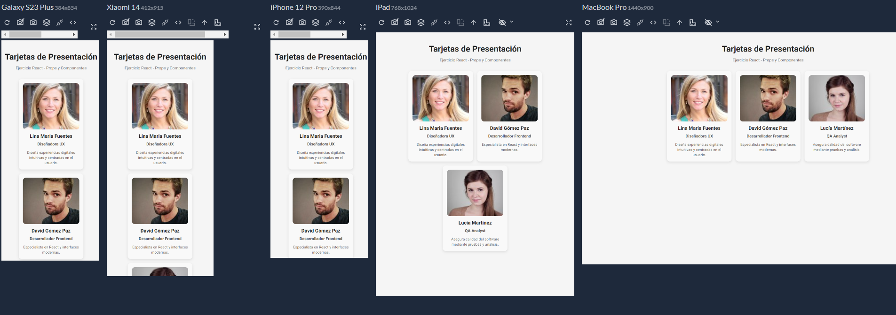

# Mi tarjeta de presentación en React

## Descripción

Proyecto realizado para la materia de Desarrollo Full Stack utilizando React y Vite.

La aplicación muestra tres tarjetas de presentación construidas a partir de un componente reutilizable llamado `Tarjeta`. Cada tarjeta recibe información mediante props, incluyendo nombre, profesión, imagen y descripción.

El objetivo principal es practicar la creación de componentes funcionales, el uso de JSX y el paso de props en React.

---

## Tecnologías utilizadas

- React
- Vite
- JavaScript
- CSS

---

## Instalación

Clonar el repositorio:

```bash
git clone https://github.com/f-Ariel-Pavoni/curso-react-js-tp4-tarjetas-presentacion
```

Ingresar al directorio del proyecto:

```bash
cd tarjetas-presentacion
```

Instalar dependencias:

```bash
npm install
```

---

## Ejecución

Iniciar el servidor de desarrollo:

```bash
npm run dev
```

Luego abrir en el navegador la dirección indicada por Vite (generalmente `http://localhost:5173`).

---

## Estructura del proyecto

```text
tarjetas-presentacion/
├── public/
│   ├── assets/
│   │   └── screenshots/
│   │       ├── escritorio.png
│   │       └── mobile.png
│   └── favicon.svg
│
├── src/
│   ├── components/
│   │   ├── Tarjeta.jsx
│   │   ├── Tarjeta.css
│   │   ├── ContenedorTarjetas.jsx
│   │   └── ContenedorTarjetas.css
│   │
│   ├── App.jsx
│   ├── main.jsx
│   └── index.css
│
├── index.html
├── package.json
├── package-lock.json
├── vite.config.js
└── README.md
```

---

## Capturas de pantalla

### Vistas de escritorio y mobile



---

## Funcionalidades implementadas

- Componente funcional reutilizable `Tarjeta`.
- Uso de props para personalizar contenido.
- Imágenes con atributo `alt` descriptivo.
- Diseño responsive mediante Flexbox y Media Queries.
- Estilos personalizados con CSS.
- Renderizado de múltiples tarjetas utilizando el mismo componente.

---

## Autor

**Ariel Pavoni**

Curso: Full Stack

Unidad: React Inicial - Módulo 1 - Unidad 4

## Créditos de imágenes

Las imágenes utilizadas en las tarjetas fueron obtenidas mediante la API pública de Random User:

https://randomuser.me
